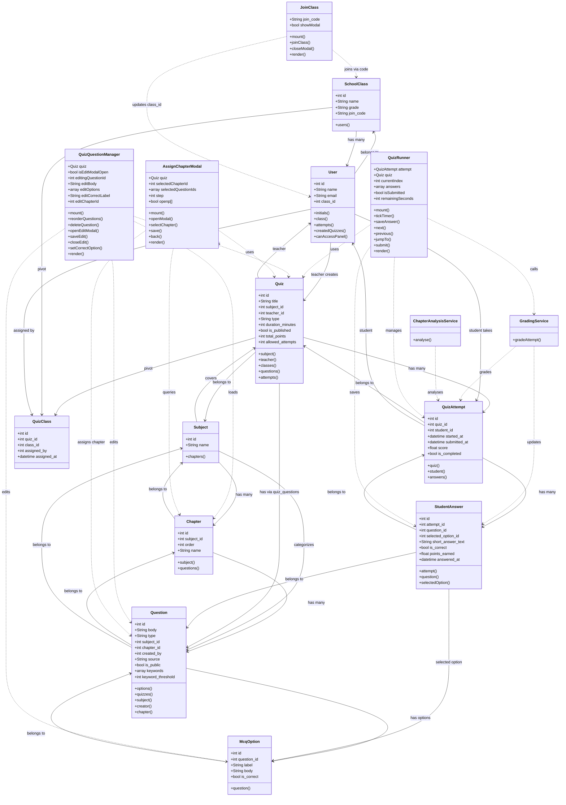

# SentosaQuiz — Relational Database ERD

Generated from all Laravel migrations. Paste the code block below into [mermaid.live](https://mermaid.live) or any Mermaid-compatible renderer.

```mermaid
erDiagram

    %% ─────────────────────────────────────────────
    %%  CORE ENTITIES
    %% ─────────────────────────────────────────────

    users {
        bigint      id              PK
        string      name
        string      email           UK
        timestamp   email_verified_at   "nullable"
        string      password
        string      remember_token  "nullable"
        bigint      class_id        FK  "nullable — students only"
        timestamp   created_at
        timestamp   updated_at
    }

    classes {
        bigint  id          PK
        string  name        "e.g. XII IPA 1"
        string  grade       "e.g. XII"
        string  join_code   UK  "nullable, 6-char"
        timestamp created_at
        timestamp updated_at
    }

    subjects {
        bigint  id      PK
        string  name    "e.g. Biologi"
        timestamp created_at
        timestamp updated_at
    }

    chapters {
        bigint  id          PK
        bigint  subject_id  FK
        int     order       "default 0"
        string  name
        timestamp created_at
        timestamp updated_at
    }

    %% ─────────────────────────────────────────────
    %%  QUESTION BANK
    %% ─────────────────────────────────────────────

    questions {
        bigint  id                  PK
        text    body
        enum    type                "mcq | short_answer"
        bigint  subject_id          FK
        bigint  chapter_id          FK  "nullable"
        bigint  created_by          FK  "→ users"
        enum    source              "manual | bank | community | ai | previous_year"
        boolean is_public           "default true"
        jsonb   keywords            "nullable"
        int     keyword_threshold   "nullable"
        jsonb   meta                "nullable"
        timestamp created_at
        timestamp updated_at
    }

    mcq_options {
        bigint  id          PK
        bigint  question_id FK
        enum    label       "A | B | C | D"
        text    body
        boolean is_correct  "default false"
    }

    %% ─────────────────────────────────────────────
    %%  QUIZZES
    %% ─────────────────────────────────────────────

    quizzes {
        bigint  id                  PK
        string  title
        bigint  subject_id          FK
        bigint  teacher_id          FK  "→ users"
        enum    type                "mid_term | final_term"  UK-with-subject
        int     duration_minutes    "nullable"
        boolean is_published        "default false"
        int     total_points        "default 100"
        int     allowed_attempts    "default 1"
        timestamp created_at
        timestamp updated_at
    }

    quiz_questions {
        bigint  id          PK
        bigint  quiz_id     FK
        bigint  question_id FK
        int     order       "default 0"
    }

    quiz_class {
        bigint      id          PK
        bigint      quiz_id     FK
        bigint      class_id    FK
        bigint      assigned_by FK  "→ users"
        timestamp   assigned_at
    }

    %% ─────────────────────────────────────────────
    %%  ATTEMPTS & ANSWERS
    %% ─────────────────────────────────────────────

    quiz_attempts {
        bigint      id              PK
        bigint      quiz_id         FK
        bigint      student_id      FK  "→ users"
        timestamp   started_at
        timestamp   submitted_at    "nullable"
        decimal     score           "5,2 — default 0"
        boolean     is_completed    "default false"
        timestamp   created_at
        timestamp   updated_at
    }

    student_answers {
        bigint      id                  PK
        bigint      attempt_id          FK
        bigint      question_id         FK
        bigint      selected_option_id  FK  "nullable — MCQ only"
        text        short_answer_text   "nullable"
        boolean     is_correct          "default false"
        decimal     points_earned       "5,2 — default 0"
        timestamp   answered_at         "nullable"
    }

    %% ─────────────────────────────────────────────
    %%  RELATIONSHIPS
    %% ─────────────────────────────────────────────

    %% Users / Classes
    classes         ||--o{  users           : "enrolls"
    users           }o--||  classes         : "belongs to"

    %% Subjects / Chapters
    subjects        ||--o{  chapters        : "has"
    chapters        }|--||  subjects        : "belongs to"

    %% Questions
    subjects        ||--o{  questions       : "categorizes"
    chapters        ||--o{  questions       : "tags (optional)"
    users           ||--o{  questions       : "created_by"
    questions       ||--o{  mcq_options     : "has options"

    %% Quizzes
    subjects        ||--o{  quizzes         : "covers"
    users           ||--o{  quizzes         : "teacher creates"
    quizzes         ||--o{  quiz_questions  : "contains"
    questions       ||--o{  quiz_questions  : "included in"

    %% Quiz ↔ Class assignment
    quizzes         ||--o{  quiz_class      : "assigned to"
    classes         ||--o{  quiz_class      : "receives"
    users           ||--o{  quiz_class      : "assigned_by"

    %% Attempts & Answers
    quizzes         ||--o{  quiz_attempts   : "attempted via"
    users           ||--o{  quiz_attempts   : "student takes"
    quiz_attempts   ||--o{  student_answers : "records"
    questions       ||--o{  student_answers : "answered in"
    mcq_options     ||--o{  student_answers : "selected option"
```

---

## Table Summary

| Table | Purpose |
|---|---|
| `users` | All users (teachers & students). `class_id` set for students. |
| `classes` | School classes. Students join via 6-digit `join_code`. |
| `subjects` | Academic subjects (e.g. Biologi). |
| `chapters` | Subject chapters, ordered per subject. |
| `questions` | Question bank — MCQ or short-answer. |
| `mcq_options` | Answer choices (A–D) for MCQ questions. |
| `quizzes` | Quizzes created by teachers, linked to a subject. |
| `quiz_questions` | Pivot — which questions appear in which quiz (ordered). |
| `quiz_class` | Pivot — which classes a quiz is assigned to, and by whom. |
| `quiz_attempts` | A student's attempt at a quiz. |
| `student_answers` | Individual answers per question within an attempt. |

---

## Class Diagram

Full application class diagram — Models, Services, and Livewire components.  
Paste the block below into **[mermaidviewer.com](https://mermaidviewer.com)**.



